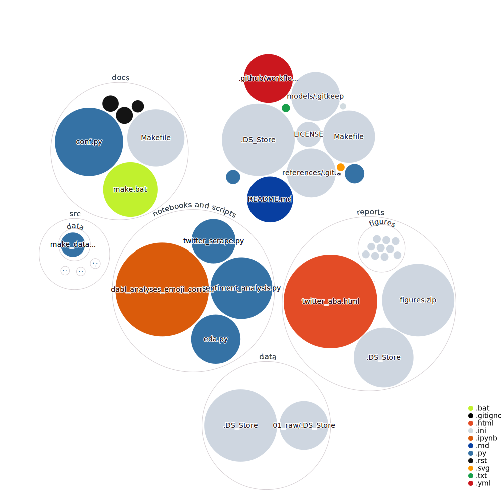

twitter-aba-sentiment
==============================

To compare sentiment about how ABA practitioners talk about their own profession compared to otehr helping professions such as in medicine. 

Project Organization
------------

    ├── LICENSE
    ├── Makefile           <- Makefile with commands like `make data` or `make train`
    ├── README.md          <- The top-level README for developers using this project.
    ├── data
    │   ├── 01_raw           <- Data from third party sources.
    │   ├── 02_intermediate  <- Dataframes in transition from raw to the primary analytic dataframe.
    │   ├── 03_primary       <- Primary analytic dataframe after cleaning
    │   ├── 04_feature       <- Dataframes in transition during feature engineering.
    │   ├── 05_model_input   <- Trimmed dataframes following feature reduction for specific modeling purposes. 
    │   ├── 06_models        <- Models resulting from parameter estimation and hyperparameter tuning. 
    │   ├── 07_model_output  <- Model outputs/predictions. 
    │   ├── 08_reporting     <- Dataframes, models, and any products for use in reporting out. 
    │
    ├── docs               <- A default Sphinx project; see sphinx-doc.org for details
    │
    ├── models             <- Trained and serialized models, model predictions, or model summaries
    │
    ├── notebooks and scripts  <- Jupyter notebooks or .py scripts. Naming convention is a number (for ordering),
    │                             the creator's initials, and a short `-` delimited description, e.g.
    │                             `1.0-jqp-initial-data-exploration`.
    │
    ├── references         <- Data dictionaries, manuals, and all other explanatory materials.
    │
    ├── reports            <- Generated analysis as HTML, PDF, LaTeX, etc.
    │   └── figures        <- Generated graphics and figures to be used in reporting
    │
    ├── requirements.txt   <- The requirements file for reproducing the analysis environment, e.g.
    │                         generated with `pip freeze > requirements.txt`
    │
    ├── setup.py           <- makes project pip installable (pip install -e .) so src can be imported
    ├── src                <- Source code for use in this project.
    │   ├── __init__.py    <- Makes src a Python module
    │   │
    │   ├── data           <- Scripts to download or generate data
    │   │   └── make_dataset.py
    │   │
    │   ├── features       <- Scripts to turn raw data into features for modeling
    │   │   └── build_features.py
    │   │
    │   ├── models         <- Scripts to train models and then use trained models to make
    │   │   │                 predictions
    │   │   ├── predict_model.py
    │   │   └── train_model.py
    │   │
    │   └── visualization  <- Scripts to create exploratory and results oriented visualizations
    │       └── visualize.py
    │
    └── tox.ini            <- tox file with settings for running tox; see tox.readthedocs.io

--------

<small>Project based on the <a target="_blank" href="https://drivendata.github.io/cookiecutter-data-science/">cookiecutter data science project template</a>. #cookiecutterdatascience</small>

# Visualization of current repository

